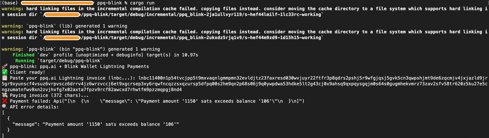

# ppq-blink

A Rust crate for topping up ppq.ai (pay-per-query AI) credits using Blink Wallet's Lightning payments.

## Screenshot





## Features

- Secure: API keys loaded from `.env` file
- Interactive: Prompts for Lightning invoice
- Simple: Pay top-ups with one command

## Installation

```bash
cargo add ppq-blink
